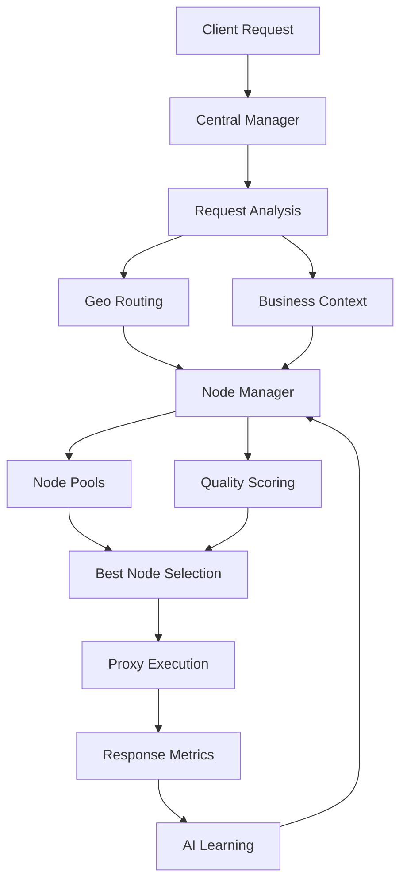

# clash-verge&Flclash&mihomo.js 智能分流配置脚本 - 使用说明

## 📖 简介

- **clash-verge&flclash&mihomo.js**：是一个专为 mihomo（Clash 变种）设计的**智能分流配置脚本**
- **singbox全自动节点分流管理插件.js**：是给singbox做的一个全自动节点的管理与分流的插件。
- **singbox全自动节点分流管理混入脚本.js**：是给singbox做的一个全自动节点的管理与分流的配置混入脚本。
- **上述三个脚本的逻辑与功能都是出自同源逻辑，只是针对各自的适用场景做了分别的优化与适配。**
- **它们都能够自动管理您的代理节点，根据网络质量、地理位置和访问需求，智能选择最佳节点，让您的网络访问更加流畅、稳定。**


## 📋 目录

- [核心特性](#核心特性)
- [系统架构](#系统架构)
- [安装与使用](#安装与使用)
- [配置说明](#配置说明)
- [核心组件](#核心组件)
- [智能路由算法](#智能路由算法)
- [性能监控](#性能监控)
- [安全特性](#安全特性)
- [API 接口](#api-接口)
- [故障排除](#故障排除)
- [开发指南](#开发指南)

## 🚀 核心特性

### 智能节点管理
- **多指标评估**：基于延迟、抖动、丢包率、吞吐量等综合指标进行节点质量评分
- **AI 驱动预测**：使用机器学习算法预测节点未来性能表现
- **自适应阈值**：根据网络环境动态调整优劣节点分类标准
- **故障转移**：自动检测节点故障并切换到最佳可用节点

### 智能路由选择
- **地理路由**：根据目标服务器地理位置智能选择最优节点
- **业务感知**：针对视频流、游戏、AI 服务等不同场景优化节点选择
- **区域分组**：自动识别和分组不同地区的节点，支持同义词映射
- **缓存优化**：多层缓存机制提升路由决策速度

### 性能优化
- **并发池调度**：高效的任务并发执行机制
- **预热机制**：系统启动时预先测试节点性能
- **LRU 缓存**：智能缓存管理，防抖清理机制
- **资源监控**：实时监控系统资源使用情况

### 安全防护
- **SSRF 防护**：阻止访问内网和回环地址
- **URL 安全化**：自动过滤和验证请求 URL
- **重定向审计**：逐跳重定向安全检查
- **隐私保护**：可选的地理位置查询开关

## 🏗️ 系统架构



### 核心模块

1. **CentralManager**：中央控制器，统筹所有功能模块
2. **NodeManager**：节点管理器，负责节点选择和切换
3. **RegionAutoManager**：区域自动管理器，处理地理分组
4. **AdBlockManager**：广告拦截管理器，自动更新规则
5. **MetricsManager**：指标管理器，收集和分析性能数据
6. **AvailabilityTracker**：可用性跟踪器，监控节点状态

## 🛠️ 安装与使用

### 环境要求
- **Node.js** >= 14.0.0 (推荐 16.0.0+)
- **现代浏览器**：支持 fetch API 和 AbortController
- **内存**：建议至少 512MB 可用内存
- **网络**：稳定的互联网连接

### 基本使用

```javascript
// 导入模块
const { main, CentralManager, Config } = require('./mihomoTareAIcopy4.js');

// 基础配置
const config = {
  proxies: [
    { name: "香港节点1", type: "ss", server: "hk1.example.com", port: 443, cipher: "aes-256-gcm", password: "your-password" },
    { name: "美国节点1", type: "vmess", server: "us1.example.com", port: 443, uuid: "your-uuid" }
  ]
};

// 处理配置
const processedConfig = main(config);
console.log('处理后的配置:', processedConfig);
```

### 高级配置

```javascript
// 自定义配置
const customConfig = {
  enable: true,
  privacy: {
    geoExternalLookup: true,          // 启用地理位置查询
    githubMirrorEnabled: true,         // 启用 GitHub 镜像
    trustedGeoEndpoints: [             // 自定义地理位置查询端点
      "https://ipapi.co/json/{ip}",
      "https://geo.ipify.org/api/v1?ip={ip}"
    ]
  },
  tuning: {
    preheatEnabled: true,              // 启用节点预热
    preheatConcurrency: 5,              // 预热并发数
    nodeTestTimeoutMs: 3000,            // 节点测试超时
    nodeTestMaxAttempts: 5              // 最大测试重试次数
  }
};
```

## ⚙️ 配置说明

### 基础配置项

| 配置项 | 类型 | 默认值 | 说明 |
|--------|------|--------|------|
| `enable` | boolean | true | 是否启用智能路由 |
| `privacy.geoExternalLookup` | boolean | false | 是否启用外部地理位置查询 |
| `privacy.githubMirrorEnabled` | boolean | false | 是否启用 GitHub 镜像加速 |
| `regionOptions.ratioLimit` | number | 2 | 节点倍率限制 |
| `tuning.preheatEnabled` | boolean | true | 是否启用节点预热 |

### 节点配置示例

```yaml
proxies:
  - name: "香港-01"
    type: ss
    server: hk1.example.com
    port: 443
    cipher: aes-256-gcm
    password: your-password
    
  - name: "美国-01"
    type: vmess
    server: us1.example.com
    port: 443
    uuid: your-uuid
    alterId: 0
    cipher: auto
    
  - name: "日本-01"
    type: trojan
    server: jp1.example.com
    port: 443
    password: your-password
    sni: jp1.example.com
```

### 服务规则配置

系统预设了丰富的服务规则，包括：
- **流媒体服务**：YouTube、Netflix、Disney+、Bilibili 等
- **AI 服务**：OpenAI、Claude、Gemini 等
- **社交应用**：Telegram、WhatsApp、Line 等
- **游戏服务**：专用游戏代理通道
- **广告拦截**：集成多源广告规则

## 🧩 核心组件

### CentralManager

中央管理器是整个系统的核心，负责协调各个模块：

```javascript
const manager = CentralManager.getInstance();

// 处理请求
const result = await manager.onRequestOutbound({
  url: "https://www.youtube.com",
  method: "GET",
  headers: {},
  user: "user1"
});

console.log('路由结果:', result);
```

### NodeManager

节点管理器负责节点的选择、切换和质量评分：

```javascript
const nodeManager = NodeManager.getInstance();

// 获取最佳节点
const bestNode = await nodeManager.getBestNode(proxies, { country: "United States" });

// 切换到指定节点
await nodeManager.switchToNode("node-id", { country: "Hong Kong" });
```

### RegionAutoManager

区域自动管理器处理节点的地理分组：

```javascript
const regionManager = new RegionAutoManager();

// 发现新区域
const discovered = regionManager.discoverRegionsFromProxies(proxies);

// 构建区域分组
const { regionProxyGroups } = regionManager.buildRegionGroups(config, regions);
```

## 🧠 智能路由算法

### 节点质量评分算法

系统采用多维度评分机制：

```javascript
// 评分权重配置
const weights = {
  quality: 0.5,        // 历史质量评分
  metrics: 0.35,       // 实时性能指标
  success: 0.15         // 成功率权重
};

// 综合评分计算
const score = (quality * weights.quality) + 
             (metricScore * weights.metrics) + 
             (successRate * weights.success);
```

### 业务感知路由

根据不同业务场景优化节点选择：

- **视频流**：优先选择高吞吐量节点
- **游戏应用**：优先选择低延迟、低抖动节点
- **AI 服务**：优先选择稳定性和成功率高的节点
- **大文件下载**：优先选择高带宽节点

### 地理路由优化

```javascript
// 区域同义词映射
const REGION_SYNONYMS = {
  "Hong Kong": ["Hong Kong", "HK", "香港"],
  "United States": ["United States", "US", "USA", "美国"],
  "Japan": ["Japan", "JP", "日本"]
};
```

## 📊 性能监控

### 实时指标收集

系统实时收集以下性能指标：
- **延迟 (Latency)**：请求响应时间
- **抖动 (Jitter)**：延迟变化幅度
- **丢包率 (Loss)**：数据包丢失比例
- **吞吐量 (Throughput)**：数据传输速率
- **成功率 (Success Rate)**：请求成功百分比

### AI 预测模型

使用机器学习预测节点未来性能：

```javascript
// 特征提取
const features = extractNodeFeatures(node, currentMetrics, history);

// 风险评估
const prediction = predictNodeFuturePerformance(features);

// 分数调整
const adjustment = calculateScoreAdjustment(prediction, success);
```

### 性能优化机制

- **LRU 缓存**：智能缓存路由决策结果
- **防抖清理**：避免频繁的缓存清理操作
- **并发控制**：限制并发测试数量，保护系统资源
- **预热机制**：系统启动时预先评估节点性能

## 🔒 安全特性

### SSRF 防护

```javascript
// 安全端口列表
const SAFE_PORTS = new Set([80, 443, 8080, 8081, 8088, 8880, 8443]);

// 私网地址检测
function isPrivateIP(ip) {
  const [a, b] = ip.split(".").map(n => parseInt(n, 10));
  return a === 10 || a === 127 || (a === 192 && b === 168) || (a === 172 && b >= 16 && b <= 31);
}
```

### URL 安全化

- **协议过滤**：仅允许 HTTP/HTTPS 协议
- **自动升级**：HTTP 自动升级为 HTTPS
- **重定向审计**：逐跳检查重定向安全性
- **Data URL 限制**：限制内联资源大小和类型

### 隐私保护

- **可选地理位置查询**：用户可选择是否启用外部地理位置服务
- **本地缓存**：地理位置信息本地缓存，减少外部查询
- **数据脱敏**：敏感信息处理和存储

## 🔌 API 接口

### 主要 API

```javascript
// 处理请求
async handleProxyRequest(req, ...args)

// 智能节点调度
async smartDispatchNode(user, nodes, context)

// 请求处理
async onRequestOutbound(reqCtx)

// 响应处理
async onResponseInbound(resCtx)

// 获取地理位置
async getGeoInfo(ip, domain)

// 域名解析
async resolveDomainToIP(domain)
```

### 配置处理

```javascript
// 处理代理配置
processConfiguration(config)

// 生成代理组
buildRegionGroups(config, regions)

// 注入规则提供者
injectRuleProvider(ruleProviders)
```

### 性能测试

```javascript
// 多指标测试
async testNodeMultiMetrics(node)

// TCP 连接测试
async tcpConnectLatency(host, port, timeout)

// 吞吐量测量
async measureResponse(response)
```

## 🔧 故障排除

### 常见问题

1. **节点切换频繁**
   - 检查 `AVAILABILITY_MIN_RATE` 设置
   - 调整 `BASE_SWITCH_COOLDOWN` 参数
   - 查看节点质量评分阈值

2. **性能评分异常**
   - 检查节点测试超时设置
   - 验证节点连通性
   - 查看系统日志输出

3. **地理位置查询失败**
   - 检查网络连接
   - 验证 `trustedGeoEndpoints` 配置
   - 检查防火墙设置

### 调试模式

```javascript
// 启用调试日志
const CONSTANTS = {
  ENABLE_SCORE_DEBUGGING: true
};

// 查看详细日志
Logger.debug("Central.debug", "调试信息", data);
```

### 日志级别

- `ERROR`：错误信息，需要立即关注
- `WARN`：警告信息，可能影响功能
- `INFO`：一般信息，正常运行状态
- `DEBUG`：调试信息，仅在调试模式下显示

## 👨‍💻 开发指南

### 代码结构

```
mihomoTareAIcopy4.js
├── 平台检测 (PLATFORM)
├── 常量定义 (CONSTANTS)
├── 日志系统 (Logger)
├── 工具函数 (Utils)
├── GitHub 镜像管理
├── 配置管理 (Config)
├── 事件系统 (EventEmitter)
├── 缓存系统 (LRUCache)
├── 统计模块 (RollingStats, SuccessRateTracker)
├── 区域管理 (RegionAutoManager)
├── 广告拦截 (AdBlockManager)
├── 节点池 (NodePools)
├── 中央管理器 (CentralManager)
├── 节点管理器 (NodeManager)
├── 指标管理器 (MetricsManager)
└── 主入口 (main)
```

### 扩展开发

#### 添加新的地理位置提供者

```javascript
// 在 Config.privacy.trustedGeoEndpoints 中添加
"https://your-geo-api.com/json/{ip}"

// 在 _fetchGeoSeries 方法中处理响应格式
const country = json.country_name || json.country || "Unknown";
const region = json.region || json.city || "Unknown";
```

#### 自定义评分算法

```javascript
// 扩展 scoreComponents 方法
static scoreComponents(m = {}) {
  // 现有评分逻辑
  const baseScore = // ... 现有计算
  
  // 添加自定义评分
  const customScore = yourCustomAlgorithm(m);
  
  return { 
    ...baseScore, 
    customScore,
    metricScore: baseScore.metricScore + customScore 
  };
}
```

#### 添加新的服务规则

```javascript
// 在 Config.services 中添加
{
  id: "yourservice",
  rule: ["DOMAIN-SUFFIX,yourservice.com,你的服务"],
  name: "你的服务",
  url: "https://yourservice.com/health",
  icon: ICON_VAL(ICONS.YourIcon)
}
```

### 性能优化建议

1. **合理设置并发数**：根据服务器性能调整 `CONCURRENCY_LIMIT`
2. **优化缓存策略**：调整 LRU 缓存大小和 TTL
3. **减少外部查询**：启用地理位置缓存，设置合理的 TTL
4. **监控内存使用**：定期清理过期数据和缓存

### 贡献指南

1. Fork 项目
2. 创建特性分支 (`git checkout -b feature/AmazingFeature`)
3. 提交更改 (`git commit -m 'Add some AmazingFeature'`)
4. 推送到分支 (`git push origin feature/AmazingFeature`)
5. 开启 Pull Request

## 📄 许可证

本项目采用 MIT 许可证 - 查看 [LICENSE](LICENSE) 文件了解详情。

## 🤝 支持

如果您在使用过程中遇到问题，请：

1. 查看本文档的故障排除部分
2. 检查系统日志输出
3. 提交 Issue 描述问题现象
4. 提供详细的配置信息和错误日志

---

**注意**：本系统仅用于学习和研究目的，请遵守当地法律法规和网络使用规范。
